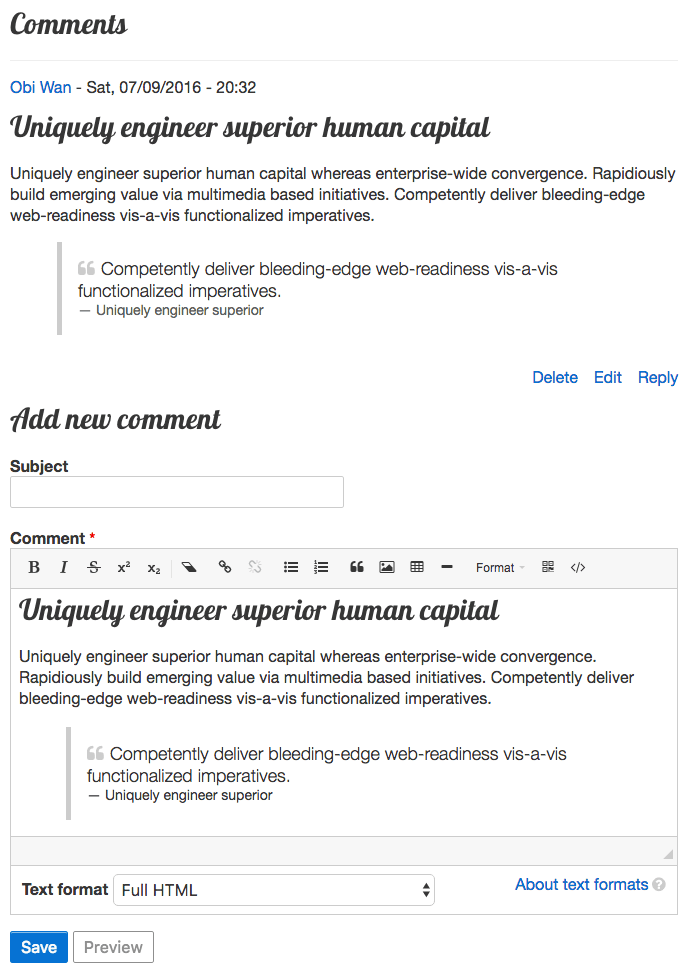

## Mimic CKEditor Skin

Adaptivetheme includes a CKEditor skin called Mimic. Mimic automatically inherits your themes colors, backgrounds, fonts, icons, heading and other text styles to give you are more realistic WYSIWYG experience. 

Mimic requires Font awesome for it's toolbar icons - Font awesome is included in every Adaptivetheme sub-theme by default, so just be aware of that if you choose to remove Font awesome support from your sub-theme.

Mimic is a very minimal looking skin, designed for the modern, clean looking themes popular today.

If you prefer to use Druapls default CKEditor skin (moono) you can turn Mimic off in the CKEditor skins extension (it's the only setting).

Below is an example of Mimic on comment forms, we are using Google fonts and the blockquote has a Font Awesome icon set in CSS - can you tell the difference between the published comment and the one in the editor?

