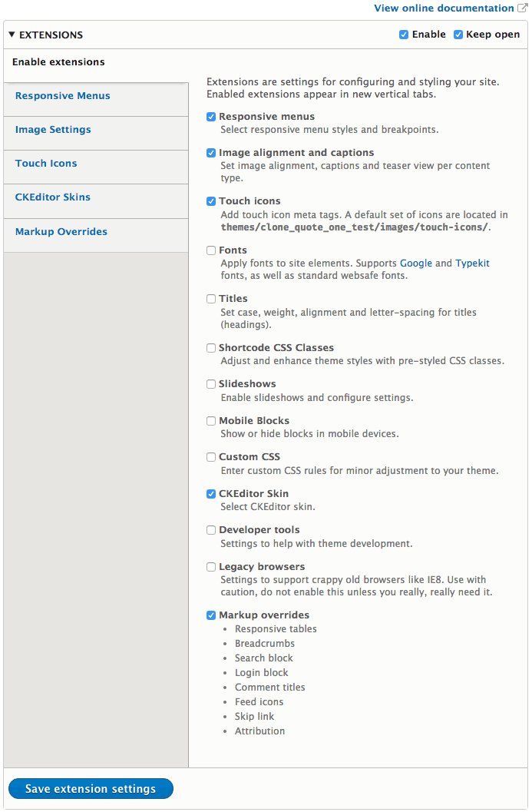

# Extensions Overview

Adaptivetheme provides settings that allow you to modify the style, fonts, layout many other aspects of your theme without writing code.

You can enable or disable extensions from the Enable extensions tab. Check the box and Save Extensions Settings to enable new extensions. A new tab will appear where you can set options for the new extensions settings. 

Disable all extensions by un-checking the "Enable" checkbox at the top of the form and saving the setting.

