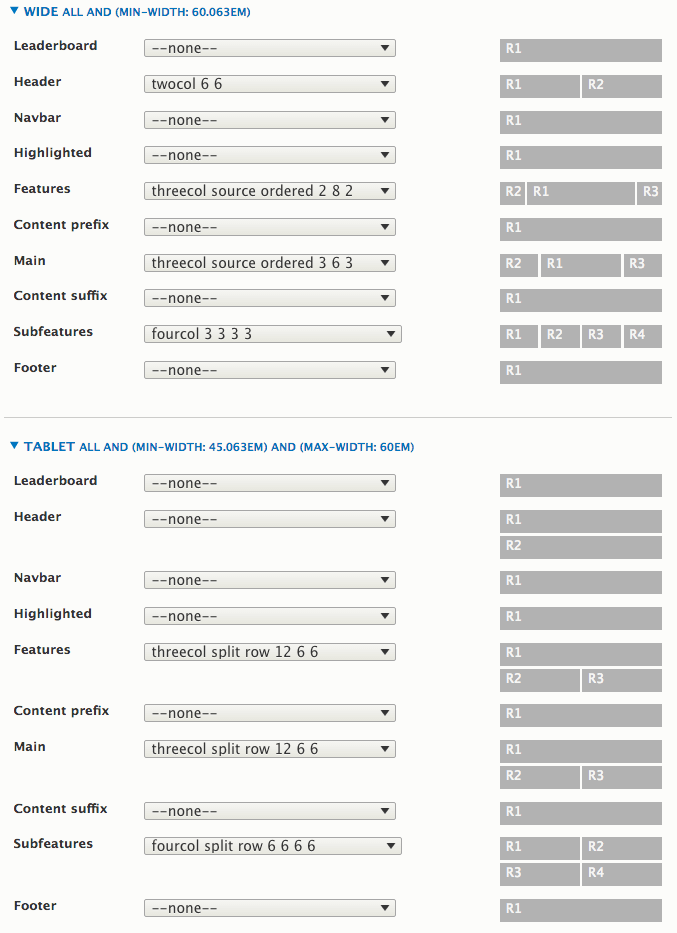
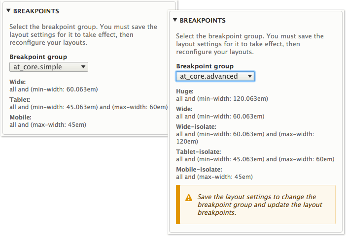

## Breakpoints & Media Queries

Breakpoints are the "point" at which the layout "breaks" or _changes_ to a new layout.

We define breakpoints using media queries. Browsers use media queries to know when to apply a layout.

Adaptivetheme allows you set layouts per breakpoint (i.e. per media query). 

## Breakpoint Groups

Drupal core ships with a module called "Breakpoints". Themes declare their breakpoints in a yml text file and Drupal loads these for use by any other theme or module.

Adaptivetheme ships with three groups of breakpoints - Simple, Advanced and Responsive menu breakpoints. By default the Simple group is used by the Layout system. These suffice the vast majority of sites and have been carefully selected to work in all devices and screen sizes.

The Simple group uses _isolated breakpoints_ to give a clean separation between mobile, tablet and wide screens. These breakpoints do not "cascade" into each other, so the layout is never trying to override one set for a narrower screen. Here is a simple visual representation:

```
# mobile  - 0 to 45em (0 to 720px), small screens only.
# tablet  - 45.063em and max-width 60em (721px to 960px), isolate tablets.
# wide    - 60.063em (961px) and up.
#
# 0                45em                60em
# | mobile --------->|
#                    | tablet ---------->|
#                                        | wide ---------------------------->
```

Obviously there are tablets with resolutions higher than 60em (960px), so those devices will get the Wide layout (e.g. iPad Retina in landscape orientation), which is perfectly fine - they have the screen resolution to display it properly.


### Set Row Layouts Per Breakpoint

Whatever is set for each breakpoint will fire the moment that screen width is detected by the browser.

Consider the screen-shot below - here we compare the Wide layout to a Tablet layout.

1. Note the Header row in Tablet, set to --none-- so the regions stack.
2. Features & Main use source ordered layouts in Wide, and maintain the source order in Tablet using a Split row layouts.
3. Subfeatures is a standard 4 col layout in Wide, but switches to a Split row grid in Tablet.

Note: in the mobile breakpoint (not shown) --none-- is set for all rows, i.e. all regions stack.



### Changing the Breakpoint Group

You can select from any valid Breakpoint group defined by any theme or module. The Breakpoints module makes them all available to use in your theme. If you change the breakpoint group you must save the layout settings for them to take effect, and then set layout for each breakpoint.




### Defining new Breakpoints

Breakpoints for Drupal 8 are declared in a YML text file at the root of your theme, or the root of the base theme, in this case at_core, i.e. `adaptivetheme/at_core/at_core.breakpoints.yml`

To read more about how to declare your own breakpoints see the [Breakpoints & Media Queries](../theming/breakpoints.md) page.

