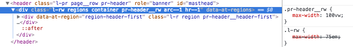

## Max-widths Overview

The max-width or "maximum width" is the widest the page or row is allowed to expand. If set to 100% the page will be 100% of the screen. 

Adaptivetheme uses em units for setting the max-width (and all media queries) so the page is _elastic_ and can expand and contract (and switch breakpoint) as the user changes the global font size in their browser.

Remember - the responsive grid is set in percentages, so they always flex if the viewport width changes.

### Settings 

The max-width settings allow you override the page max-width and/or each row width. The original max-width is set in your themes layout CSS, which is why it's called an override (overriding the orignal CSS values).

You can easily set one or more rows to be full width (or any other width), while others have a constrained width.

Setting widths is strait forward - open the Max-Width field and check Override max-widths. You can set the Global max width or per row.

### Per Row

The max-width is set in CSS (generated CSS file) and applies to that rows region wrapper div - you see the override in place when inspecting the CSS - note the default width of 75em being overridden with 100vw (viewport width unit).

Note: the max-width override will not remove padding or margin set on the on internal elements such as regions and blocks - to remove this also you can use the Shortcodes extension and the Whitespace Control classes.

### Units

There are five different units to choose from:

- em
- rem
- %
- vw
- px

The recommendation is to use a flexible unit such as % (percentage) or vw (viewport width). Setting the max-width in a fixed unit such as px, em or rem may not work for small screens and responsive design.

