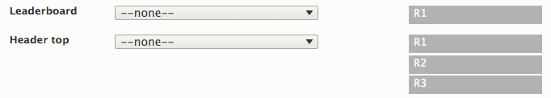

## Site-builder Layout

The default layout library is called "site-builder", located in: `mytheme/layout/site-builder`.

Inside the "site-builder" directory locate the file called: `site-builder.markup.yml`

Open this file in a text editor.

## How to add new rows and regions.

All "regions" are children of a parent "row". You can add new regions to an existing row, or create new rows and regions.

Locate the "rows" key in `site-builder.markup.yml`, you will see all row/region declarations below this key - here we can view the leaderboard row. It has one region.

```
# rows: holds all rows and regions.
# row-name: the row machine-name.
# attributes: row attributes, add id/role (string) or an array of classes, data-attr etc.
# regions: holds all region declarations.
# region-machine-name: the machine readable region name, lowercase and underscores only.
# region label: Friendly region name for use in the user interface.
# region order: Set the source order.

rows:
  leaderboard:                # row machine name.
    attributes:               # row attributes.
      id: leaderboard
    regions:                  
      leaderboard:            # region machine-name.
        label: 'Leaderboard'  # region label.
        order: 1              # source order in this row.
```

Now lets add a new row below the leaderboard, with three regions - we can call this row "header_top", because in the default layout this would appear just above the Header row.

```
rows:
  leaderboard:                # row machine name.
    attributes:               # row attributes.
      id: leaderboard
    regions:                  
      leaderboard:            # region machine-name.
        label: 'Leaderboard'  # region label.
        order: 1              # source order in this row.
  header_top:
    attributes:
      id: header-top
    regions:
      header_top_first:
        label: 'Header top first'
        order: 1
      header_top_second:
        label: 'Header top second'
        order: 2
      header_top_third:
        label: 'Header top third'
        order: 3
```

Save the file and **clear the Drupal cache** (~/admin/config/development/performance). 

Go to your theme settings and reload the page. Initially the new row will have no layout - all the regions are stacked and set to "--none--".



Now set the Layout, for example we make it a standard 3 column layout with each region being 4 cols wide (the layout uses a 12 column grid).
 


Remember to add layout for all breakpoints or leave set to --none-- if you want them to stack, for example in mobile.
 
Save the layout settings and you are now ready to add blocks to the new regions.
 
 
 


