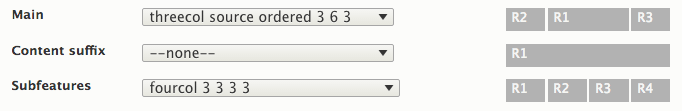
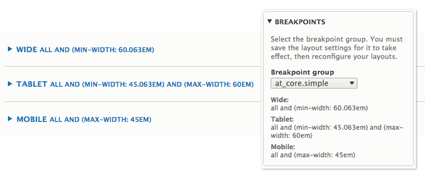
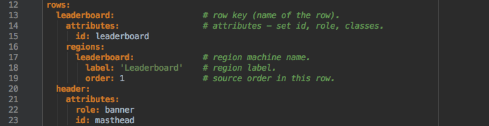
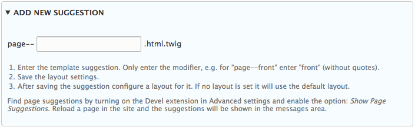
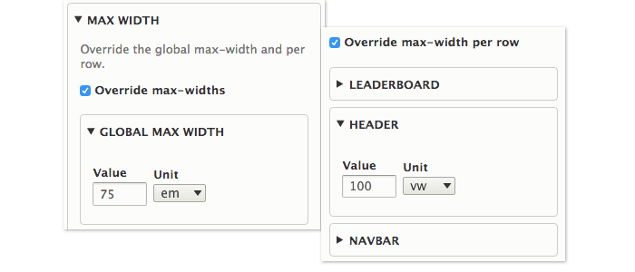

## Layout Overview

The layout settings control the _page layout_. The page is divided into **rows**, and in reach row is a group of **regions**. 

**[Select row layouts](setting-layouts.md)** from the options drop list. Visual sliders show each regions width and position.

You can set a different layout for each **[breakpoint](breakpoints.md)**. Breakpoints allow for different layouts in different size screens, such as mobile, tablet and desktop.

Creating **[new regions](new-regions.md)** requires editing a simple text file and adding row and region declarations.

**[Template Suggestions](template-suggestions.md)** are used to set layout for either a particular page in the site, e.g. the front page, or a group of pages, e.g. all forum pages.

The **[max-width](max-width.md)** settings allows you override the page max-width and/or each row width. You can easily set one or more rows to be full width, while others have a constrained width.

When you save a layout a new page.html.twig file is generated along with an updated theme-name.info.yml file. You can **[backup](backups.md)** the existing files automatically.

