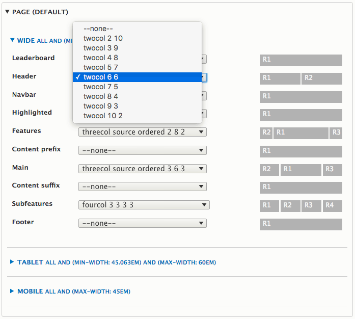

## Setting Row Layouts

Layout is set per row. Within each row is one or more regions - the layout you select sets the width and position of the regions. In Drupal a "region" is a container into which you place "blocks" that hold content.

The layout options for each row depend on how many regions are in the row. For rows with only one region you can pad the region, for rows with multiple regions there are many different layouts including content source ordered layouts, spilt row, grids, reverse float, symmetric and asymmetric layouts.

### 12 Column Grid

All layouts are based on a 12 column flexible grid. You will notice the regions widths always add up to 12 where the regions are adjacent each other. Some layouts are "split row" where one region may be the full 12 grid cols wide.

The visual sliders will aways represent the layout, so you can easily see what you'e going to get in the layout if all regions are active (have blocks enabled for them).

The example screen-shot shows a two region layout for the Header row:

### Region Source Order

Regions are marked with R1, R2 etc. The number corresponds to the actual source order of the region in the html markup, e.g. for a row with three regions:

- R1 - first
- R2 - second
- R3 - third

This is important to watch as some layouts are _source ordered_, meaning they reorder the visual layout, e.g. a three column layout may visually look like this: R2 - R1 - R3, such as the "Features" and "Main" rows in the above screen-shot.

### Collapsible Regions

All regions are collapsible. This means the layout will always account for in-active regions (regions with no visible blocks). 

For example if you have a three column layout, but only two regions have blocks, the layout will automatically adjust the width of the active regions to take up the available space.

### Config

The settings are saved in the themes configuration, so they are exportable.