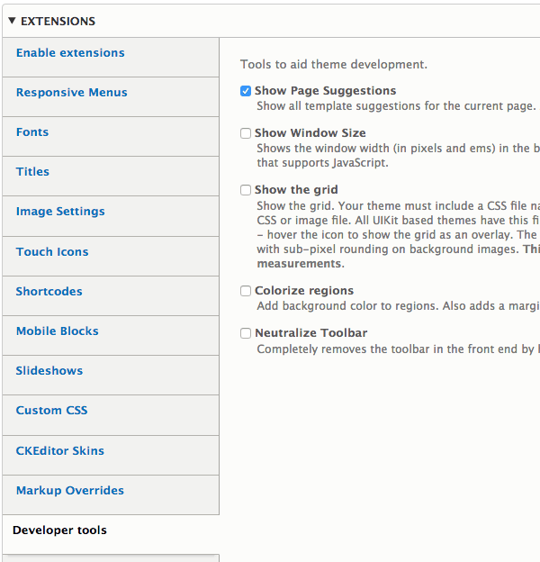

## Generating Template Suggestions

Twig template suggestions are used to set different layouts for certain pages in your site. For example the front page, pages that display nodes, user pages and much more. 

To generate a new template suggestion open the "Add New Suggestion" field:

1. Enter the template suggestion modifier (omit page--):
2. Save the layout settings

Your new template will be generated and saved to:

`mytheme/templates/generated/page--[suggestion].html.twig`

## Available Suggestion

By default Drupal core provides the following suggestions patterns for page templates: `page--[front|internal/path].html.twig`

To discover the suggestions that apply to the pages in your site turn on the Developer Tools extension and enable "Show Page Suggestions", the clear the cache. 

The template suggestions applicable to the page you are viewing will show in the Messages area.
 
 
 
 Note: an alternative option is to turn on [Twig debugging](https://www.drupal.org/node/1903374) and see all template suggestions for all templates in html comments in the page source code.
 
