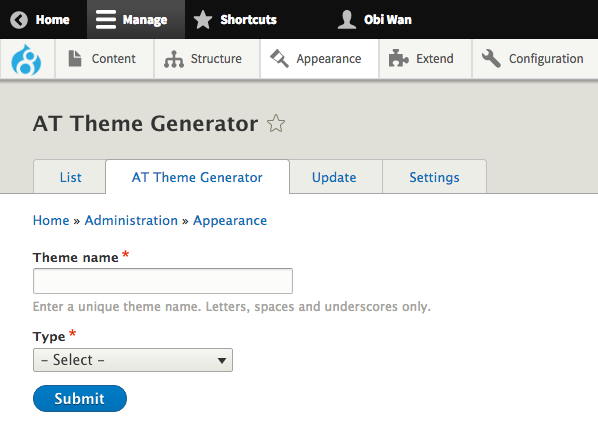

## Install Theme Generator Module

The Theme Generator is part of the AT Tools module. For installation and requirements details please see the [Installation](install.md) docs page.

Once AT Theme Generator module is installed visit the Appearance settings page. There will be a new tab "AT Theme Generator", click the tab.

## Generating Themes

* Enter a unique theme name. 
* Select the type of theme - either a new theme based on the "Standard kit" or a Clone of an existing theme.

### Standard Kit

#### Options:
* **UIKit**: a SCSS user interface library to style your theme. If do not select this your theme will only include regular CSS files.
* **Color module**: this will enabled basic color module support. By default the color scheme is rudimentary and relies on the "shift" method to colorize most elements in the theme.
* **Templates**: Copies all the at_core twig templates to your theme, only check this option if you need to override many files. Otherwise just copy the ones you need manually when required.
* **theme-settings.php**: Check this if you intend to build new custom theme settings for your theme.

#### Description
Enter a description for your new theme. If no description is entered the Generator will insert a generated description for you.

#### Version
Enter a version string. If no version string is entered the Generator will insert a generated description for you.

### Clone
Clones are exact copies of an existing theme. After selecting Type: Clone you can choose the "Clone source", which is the theme to be cloned.

There are only two options - description and version string.

After you theme has been generated visit the "List" tab where you can enable it.

